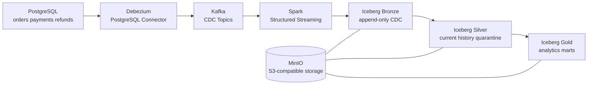

# CDC 기반 주문/결제 Lakehouse

PostgreSQL 주문/결제/환불 원천 데이터의 변경 사항을 Debezium CDC로 캡처하고, Kafka와 Spark를 거쳐 Apache Iceberg Lakehouse에 적재하는 데이터엔지니어링 포트폴리오 프로젝트입니다.

이 프로젝트는 단순 ETL 예제가 아니라, **원본 변경 이벤트 보존, 현재 상태 재구성, 분석 mart 생성, 데이터 품질 검증, 재처리와 장애 복구 문서화**까지 포함한 로컬 end-to-end Lakehouse 구현을 목표로 합니다. 기본 실행 환경은 Docker Compose이며, Lakehouse 저장소는 로컬 파일시스템이 아니라 MinIO 기반 S3-compatible object storage를 사용합니다.

## 핵심 요약

- CDC 파이프라인: PostgreSQL -> Debezium -> Kafka -> Spark -> Iceberg
- Lakehouse 계층: Bronze raw CDC, Silver current/history/quarantine, Gold mart
- Object storage: MinIO, `s3a://lakehouse/warehouse`
- CDC 처리 원칙: `event_id` dedup, soft delete, stale event quarantine, replayable downstream tables
- 운영 관점: replay script, quality check, failure recovery docs, monitoring metric definitions

## 빠른 실행

필수 조건:

- Docker 및 Docker Compose
- Bash 호환 shell

로컬 환경 설정 파일 생성:

```bash
cp .env.example .env
```

로컬 인프라 실행:

```bash
./scripts/start.sh
```

Debezium connector 등록:

```bash
./scripts/register-connector.sh
```

전체 검증 흐름 실행:

```bash
./scripts/verify-all.sh demo-001
```

수동 실행 순서:

```bash
./scripts/check-connector.sh
./scripts/run-simulator.sh --run-id demo-001
./scripts/run-spark-job.sh /opt/orderflow/spark/jobs/bronze_ingestion/main.py --once
./scripts/replay-silver.sh
./scripts/rebuild-gold.sh
./scripts/run-quality-checks.sh
```

예상 품질 검증 결과:

```text
quality_check_summary total=24 failed=0
```

검증된 로컬 실행 기준 대표 row count:

```text
silver_orders_current=9
silver_payments_current=9
silver_refunds_current=3
silver_quarantine_events=0
gold_daily_order_payment_summary=3
gold_order_funnel_summary=3
gold_payment_failure_summary=1
gold_refund_summary=1
```

## 아키텍처



기본 object storage 설정:

- Runtime: MinIO
- Bucket: `lakehouse`
- Iceberg warehouse: `s3a://lakehouse/warehouse`
- Checkpoint base: `s3a://lakehouse/checkpoints`
- File format: Parquet
- CDC payload format: JSON

Iceberg table data file과 metadata file은 모두 S3-compatible object storage에 저장됩니다. 기본 설정에서 로컬 `file://` warehouse는 사용하지 않습니다.

## 도메인 범위

- `customers`
- `products`
- `orders`
- `order_items`
- `payments`
- `refunds`

## Lakehouse 계층

### Bronze

Debezium CDC 이벤트를 append-only로 보존하는 원본 보존 계층입니다. 가능한 한 Debezium payload를 유지하고, 이후 재처리의 기준 데이터로 사용합니다.

주요 테이블:

- `lakehouse.bronze.bronze_customers_cdc`
- `lakehouse.bronze.bronze_products_cdc`
- `lakehouse.bronze.bronze_orders_cdc`
- `lakehouse.bronze.bronze_order_items_cdc`
- `lakehouse.bronze.bronze_payments_cdc`
- `lakehouse.bronze.bronze_refunds_cdc`

### Silver

Bronze CDC 이벤트를 기반으로 비즈니스 entity의 현재 상태와 변경 이력을 재구성합니다. delete 이벤트는 물리 삭제하지 않고 soft delete로 처리합니다.

주요 테이블:

- `lakehouse.silver.silver_orders_current`
- `lakehouse.silver.silver_orders_history`
- `lakehouse.silver.silver_payments_current`
- `lakehouse.silver.silver_payments_history`
- `lakehouse.silver.silver_refunds_current`
- `lakehouse.silver.silver_refunds_history`
- `lakehouse.silver.silver_quarantine_events`

### Gold

Silver current table을 기반으로 분석용 mart를 생성합니다.

주요 테이블:

- `lakehouse.gold.gold_daily_order_payment_summary`
- `lakehouse.gold.gold_order_funnel_summary`
- `lakehouse.gold.gold_payment_failure_summary`
- `lakehouse.gold.gold_refund_summary`

## 핵심 처리 원칙

- Debezium delete 이벤트는 Silver에서 `is_deleted = true`로 soft delete 처리합니다.
- 중복 CDC 이벤트는 `event_id` 기준으로 제거합니다.
- 이벤트 최신성은 `source_lsn`, `source_tx_id`, `event_ts`, Kafka offset을 고려합니다.
- current table은 PK별 최신 상태를 저장합니다.
- history table은 row-level 변경 이력을 보존합니다.
- 오래된 이벤트는 stale event로 판단해 `silver_quarantine_events`에 분리합니다.
- Silver와 Gold는 Bronze를 기준으로 재처리 가능하게 설계했습니다.

## 설계 트레이드오프

- Bronze는 Kafka CDC topic을 읽는 Spark Structured Streaming job으로 구현했습니다.
- Silver와 Gold는 로컬 포트폴리오 환경에서 재처리 가능성을 명확히 보여주기 위해 deterministic rebuild job으로 구현했습니다.
- 운영 환경에서는 Silver current table 갱신을 `foreachBatch`와 Iceberg `MERGE INTO` 기반 continuous upsert로 확장할 수 있습니다.
- 이 프로젝트는 MinIO를 기본 object storage로 사용하지만, S3A 설정과 warehouse path를 기준으로 AWS S3 전환이 가능하도록 문서화했습니다.
- 모니터링은 실제 Prometheus/Grafana stack을 띄우기보다 `docs/monitoring_metrics.md`에 운영 지표를 정의하는 방식으로 범위를 제한했습니다.

## 데이터 품질 검증

품질 검증은 Great Expectations 없이 자체 Python/Spark script로 구현했습니다. PostgreSQL source는 Spark JDBC로 조회하고, Iceberg table은 Spark SQL로 조회합니다.

검증 예시:

- `orders.total_amount = sum(order_items.item_amount)`
- `payments.approved_amount <= orders.total_amount`
- 누적 `refund_amount <= payment.approved_amount`
- `PAID` 주문은 `CAPTURED` 결제를 가져야 함
- `REFUNDED` 주문은 `COMPLETED` 환불을 가져야 함
- source row count와 Silver current active row count 비교
- Bronze duplicate `event_id` 확인
- quarantine event count 확인

실행:

```bash
./scripts/run-quality-checks.sh
```

## 프로젝트 구조

```text
.
|-- debezium/          # Debezium connector 설정
|-- docs/              # 설계, 실행, 운영, 복구 문서
|-- iceberg/ddl/       # Iceberg table DDL
|-- postgres/          # 원천 DB schema 및 seed SQL
|-- quality/           # 데이터 품질 검증 코드
|-- scripts/           # 실행, 재처리, 검증 스크립트
|-- simulator/         # PostgreSQL transaction simulator
`-- spark/             # Spark jobs 및 공통 유틸리티
```

## 주요 문서

설계 문서:

- [Architecture](docs/architecture.md)
- [Domain Model](docs/domain_model.md)
- [Lakehouse Design](docs/lakehouse_design.md)
- [Object Storage Design](docs/object_storage_design.md)
- [Gold Mart Design](docs/gold_mart_design.md)

CDC 및 원천 데이터:

- [Source Schema](docs/source_schema.md)
- [CDC Event Contract](docs/cdc_event_contract.md)
- [Kafka Topics](docs/kafka_topics.md)
- [State Transition Rules](docs/state_transition_rules.md)

운영 및 재처리:

- [Runbook](docs/runbook.md)
- [Reprocessing Strategy](docs/reprocessing_strategy.md)
- [Failure Recovery](docs/failure_recovery.md)
- [Monitoring Metrics](docs/monitoring_metrics.md)

품질 검증:

- [Data Quality Rules](docs/data_quality_rules.md)

진행 상태:

- [Progress](docs/progress.md)

## 면접에서 설명할 포인트

- Bronze가 Debezium payload를 append-only로 보존하는 이유
- `event_id`, `source_lsn`, `source_tx_id`, `event_ts`, Kafka offset을 함께 보는 이유
- delete 이벤트를 soft delete로 처리한 이유
- stale event를 quarantine으로 분리한 이유
- Silver/Gold를 Bronze 기준으로 재처리 가능하게 만든 이유
- MinIO에서 AWS S3로 전환할 때 바뀌는 설정
- Iceberg metadata와 Parquet data file이 object storage에 저장되는 구조
- local portfolio 환경과 production streaming upsert 환경의 차이

## 현재 상태

STEP 0부터 STEP 11까지 계획한 포트폴리오 범위를 완료했습니다.

구현 범위:

- PostgreSQL source schema 및 seed data
- 주문/결제/환불 transaction simulator
- Debezium PostgreSQL connector
- Kafka CDC topic 문서 및 sample consume script
- Spark 공통 runtime
- Bronze CDC ingestion
- Silver current/history/quarantine rebuild
- Gold mart rebuild
- 자체 데이터 품질 검증 script
- 재처리, 장애 복구, 모니터링 지표 문서
